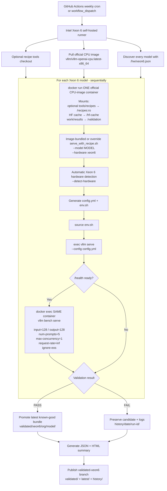

# Xeon 6 vLLM Recipe Validation

Intel-internal CI harness that discovers **all current Xeon 6 renderings** from
`recipes.vllm.ai`, validates each one on a real Xeon 6 host with the official
vLLM CPU image, and runs a quick 128-input / 128-output, concurrency-1
`vllm bench serve` smoke benchmark.

The validation path intentionally follows the upstream Recipes **Getting
Started** flow: `tools/recipes/serve_with_recipe.sh --model ... --hardware
xeon6`. Recipe generation, `vllm serve`, and `vllm bench serve` all run in the
same official Docker container instance for each model.

## Inputs

1. Live Recipes catalog: `https://recipes.vllm.ai/models.json`
2. Per-model Xeon 6 rendering: `/<model>/hw/xeon6.json`
3. Image-bundled `tools/recipes/serve_with_recipe.sh` (optional GitHub override)
4. Intel Xeon 6 self-hosted GitHub runner with Docker access
5. Official CPU image: `vllm/vllm-openai-cpu:latest-x86_64` by default
6. Optional `HF_TOKEN` and a persistent `HF_HOME` cache for gated models

No vLLM installation and no custom image build are required on the runner.


## Nightly flow

`.github/workflows/nightly-xeon6.yml` runs the same Xeon 6 validation path every
day using `vllm/vllm-openai-cpu:nightly` by default.

The schedule is `08:00 UTC`, which is approximately **1:00 AM Pacific during
daylight saving time** and **12:00 AM Pacific during standard time**. GitHub
Actions cron schedules are UTC-based, so this intentionally keeps the run near
midnight/1 AM across the year.

Nightly validation publishes to `validated-xeon6-nightly`, keeping nightly
runtime regressions separate from the weekly/stable `validated-xeon6` catalog.
Manual dispatch can override `model`, `vllm_image`, `recipe_api_base`,
`recipe_tools_repo`, and `recipe_tools_ref`.

## Weekly flow



By default, Docker uses the bundled entrypoint
`/vllm-workspace/tools/recipes/serve_with_recipe.sh`, following the
[official CPU serving instructions](https://docs.vllm.ai/en/stable/getting_started/installation/cpu/#serve-with-vllm-recipes).
No vLLM source checkout is needed. The writable `/validation` working directory
captures generated `config.yml` and `env.sh` for the validation bundle.

When `recipe_tools_repo` is supplied, the harness fetches `recipe_tools_ref` into
a fresh checkout and mounts only `tools/recipes` at `/recipes:ro`, using
`/recipes/serve_with_recipe.sh` as the entrypoint. The vLLM runtime and benchmark
CLI still come from the selected image; this option tests recipe tool changes
without rebuilding or installing vLLM. Changes elsewhere in that repository
are not loaded into the runtime.

`results/recipe-tools.json`, historical reports, and validated bundles record
whether the tools came from the image or GitHub, the override repository/ref
and resolved commit, and the image ID/digests. A bundled run has no separate
tools commit; its provenance is the image ID/digests.

## Final outputs

### Latest known-good files

```text
validated/xeon6/<org>/<model>/
├── config.yml
├── env.sh
├── recipe.json
├── validation.json
├── result.json
├── system-info.txt
└── README.md
```

A failed new run **does not overwrite** the last known-good bundle.

### Weekly results

```text
results/
├── discovery.json
├── docker-image.json
├── recipe-tools.json
├── system-info.txt
├── weekly-summary.json
├── weekly-summary.html
└── models/<org>__<model>/
    ├── config.yml
    ├── env.sh
    ├── recipe.json
    ├── result.json
    ├── server.log
    ├── benchmark.log
    └── benchmark/*.json
```

`server.log` contains both the `serve_with_recipe.sh` generation output and the
vLLM server log because that upstream script generates the files and then
`exec`s the server.

### Historical runs

`history/YYYY-MM-DD/run-<number>-attempt-<attempt>/` keeps the HTML/JSON summary and per-model test evidence for every run, including manual reruns on the same day.

## Persistent publication

The workflow restores the previous `validated/` catalog before testing and,
after the run, publishes the latest known-good bundles to the dedicated
`validated-xeon6` branch. This makes the tested files easy to consume without
searching run-scoped Actions artifacts.

```text
validated-xeon6 branch
├── validated/xeon6/<org>/<model>/config.yml
├── validated/xeon6/<org>/<model>/env.sh
└── latest/xeon6-validation.html
```

The repository workflow needs `contents: write` permission. If Intel policy
does not allow Actions to push branches, disable the publish step and replace
it with your internal artifact/object-storage publication mechanism.

## Runner prerequisites

The self-hosted Xeon runner should have:

- Python 3.10+
- Git
- Docker, with the GitHub runner user allowed to access the Docker daemon
- `numactl` for host provenance collection
- enough persistent model-cache storage for the complete Xeon 6 recipe set
- outbound HTTPS access to GitHub, Recipes, Hugging Face, and Docker Hub

The runner does **not** need host-installed vLLM or `vllm[bench]`.

Register it with labels similar to:

```text
self-hosted, linux, x64, xeon6, recipe-validation
```

Before the first run, verify Docker access as the runner user:

```bash
docker info
docker pull vllm/vllm-openai-cpu:latest-x86_64
```

By default the harness uses `$HOME/.cache/huggingface`. For a larger persistent
runner disk, set the repository variable `HF_HOME` to that path.

## Manual GitHub Actions test

The weekly and nightly workflows expose these manual inputs:

- `model`: exact model ID; leave empty for the full weekly catalog
- `vllm_image`: defaults to `vllm/vllm-openai-cpu:latest-x86_64`
- `recipe_api_base`: defaults to `https://recipes.vllm.ai`; set this to a
  Recipes Vercel preview URL to validate a Recipes PR before merge
- `recipe_tools_repo`: optional GitHub clone URL, for example
  `https://github.com/intel-ai-tce/vllm.git`; leave empty to use image-bundled tools
- `recipe_tools_ref`: branch, tag, or full commit SHA; defaults to `main` and is
  used only when `recipe_tools_repo` is set

To test the TP detection branch, set `recipe_tools_repo` to
`https://github.com/intel-ai-tce/vllm.git` and `recipe_tools_ref` to
`recipe_tools_TP_fix`. Use the preview deployment in `recipe_api_base` to test
recipe website changes together with those tools. A missing ref or missing
`tools/recipes/serve_with_recipe.sh` fails the run rather than falling back to
the image's scripts.

For the first end-to-end test, trigger **Weekly Xeon 6 Recipe Validation** with
one Xeon6 model. After that passes, leave `model` empty to exercise the same
path across all discovered Xeon6 recipes.

## Local/manual test

Run the complete catalog:

```bash
./scripts/weekly.sh
```

Run one model with the same weekly path:

```bash
TEST_MODEL=meta-llama/Llama-3.1-8B-Instruct ./scripts/weekly.sh
```

Override the official image when needed:

```bash
VLLM_IMAGE=vllm/vllm-openai-cpu:<tag>-x86_64 ./scripts/weekly.sh
```

Validate against a Recipes preview deployment instead of production:

```bash
RECIPES_BASE_URL=https://vllm-recipes-git-fork-intel-ai-tce-xeonvariantsfix-inferact-inc.vercel.app \
  ./scripts/weekly.sh
```

The same `RECIPES_BASE_URL` is used for model discovery and for
`serve_with_recipe.sh --api-base`, so a preview run does not mix preview
discovery with production recipe conversion.

Test a recipe tools fork/branch with the official CPU image:

```bash
RECIPE_TOOLS_REPO=https://github.com/intel-ai-tce/vllm.git \
RECIPE_TOOLS_REF=recipe_tools_TP_fix \
TEST_MODEL=microsoft/Phi-4-reasoning \
  ./scripts/weekly.sh
```

The previous `VLLM_REPO` / `VLLM_REF` environment variables are replaced by the
optional `RECIPE_TOOLS_REPO` / `RECIPE_TOOLS_REF` pair.

## Benchmark policy

The default quick performance check is intentionally small:

- random input length: 128
- requested output length: 128
- prompts: 5
- maximum concurrency: 1
- request rate: infinite (backpressured by max concurrency)
- `--ignore-eos` enabled to keep generated lengths comparable

Performance is recorded but this harness does not impose a TTFT/TPOT regression
threshold. Runtime success/failure and performance trend should remain separate
signals until enough historical data exists to define stable thresholds.

## Specialty/non-generation models

Text-generation models use the default `/v1/completions` + synthetic random
benchmark. Per-model benchmark adapters live in `config/model_overrides.json`.

`openai/whisper-large-v3` uses the OpenAI Audio API instead:

- backend: `openai-audio`
- endpoint: `/v1/audio/transcriptions`
- dataset: `D4nt3/esb-datasets-earnings22-validation-tiny-filtered`
- split: `validation`
- benchmark-only Python dependency: `datasets`

The official serving image intentionally does not need every optional benchmark
dependency. An override may therefore declare `benchmark.python_packages`; the
validator installs those packages into the running container's `/opt/venv` with
`uv` before invoking `vllm bench serve`. This is only for benchmark-client
dependencies and must not be used to patch missing model/runtime dependencies.

Add future embedding, reranker, or other non-generation tasks through the same
override mechanism rather than treating a generic completion-endpoint failure as
a recipe failure.
